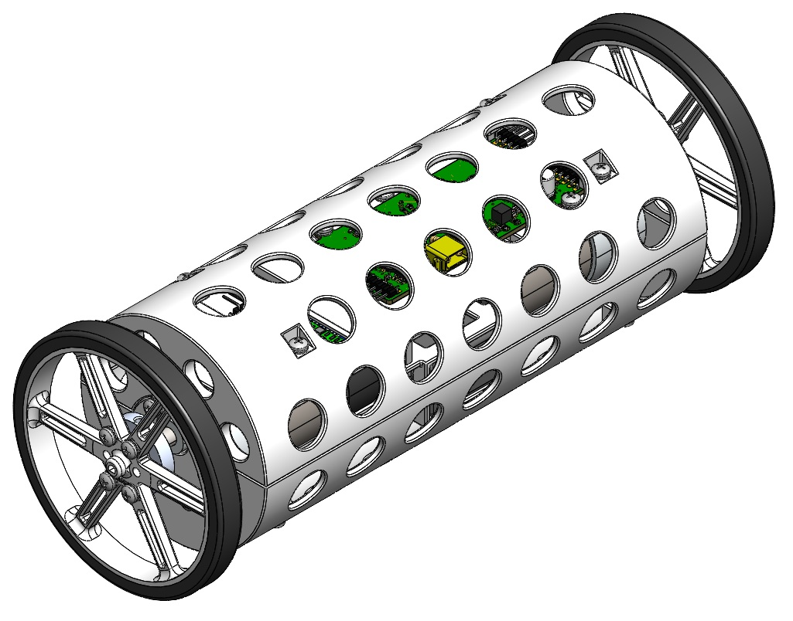

# ME 507 Romi++ Project

Design repository for Romi++, a self-balancing differential drive robot developed for Cal Poly's ME 507 Mechanical Control Systems Design class.

## Documentation

[View the complete code documentation (Doxygen)](https://jmaxwell-21.github.io/ME-507-Romi-Plus-Plus/)

## GitHub File Structure

- `Firmware/` - STM32CubeIDE project and source code and FSM diagrams
- `Hardware/` - Mechanical and electrical design files and information
- `Media/` -  Project photos and videos
- `docs/` - Doxygen-generated HTML documentation

---

Made by Jack Maxwell  
Cal Poly | Spring 2025

# Overview

Romi++ is a two-wheeled differential drive robot with a cylindrical body. It can be remotely controlled by either a computer or the custom [Smart Knob Controller](https://github.com/Larson-Nick/SmartKnobController) built by my partner and can drive at speeds up to 1&nbsp;m/s while autonomously maintaining balance through PID control.

## See Romi++ in action!
<table>
  <tr>
    <td align="center" valign="top">
      <a href="https://youtube.com/shorts/c_1nM_AD648">
         
        <strong>Official Project Demo</strong>
      </a>
      
Official project demo showcasing wireless two-wheeled robot with custom controller (using attachments before balance control was implemented).

    </td>
    <td align="center" valign="top">
      <a href="https://youtube.com/shorts/LBDbpKdLq8A">
         
        <strong>Bonus Project Demo</strong>
      </a>
      
Final demo with balance control enabled, allowing the robot to stay level while driving without attachments.

    </td>
  </tr>
</table>

This project serves as a successor to my [Romi Line-Following Robot](https://github.com/finite-colin-machine/ME-405-Romi) project from ME 405 at Cal Poly. Unlike the original Romi, which used caster wheels for stability, Romi++ is cylindrical and free to rotate about its drive axis, requiring active balance control to remain upright.

Romi++ was my term project for the ME 507 Mechanical Control Systems Design class at Cal Poly. It was a perfect blend of the four core areas of mechatronics: mechanical design, electronics, embedded systems, and control systems. These aspects of my project are explained in more depth below.

## Mechanical Design

The main components of the robot are the 3D-printed cylindrical body, two motors with wheels, a battery compartment, and various fasteners. The motors are mounted beneath the mounting plate and screw into the cylinder sides. The battery sits in a small box beneath the mounting plate, while the electronics rest on top. Long standoffs connect both cylinder halves to the mounting plate.

All 3D-printed components were custom designed, while purchased components (motors, wheels, battery, fasteners) were integrated into the assembly. The challenge was ensuring proper fitment and mounting points for each component. I imported vendor-supplied CAD models into SolidWorks and iteratively refined the design to accommodate all components with appropriate mounting holes and clearances.

See the [Mechanical Design](Hardware/Mechanical) folder for more information on specific components.

## Electrical Design

The PCB that I designed for Romi++ was my first experience with electronics design. It took up a significant portion of the 10-week course, but it was worth it for all of the experience I gained (and the fun I had)!

The PCB has 9 main components: the power distribution system to supply various voltage levels to the system, the STM32 microcontroller to control all the components, an IMU to measure heading and pitch, 2 drivers and pin headers for the motors, a pin header for the HC-05 Bluetooth module, a pin header for the ST-Link debugger, a reset button, and a general-purpose user button. I designed the [schematic](Hardware/Electrical/PCB%20Schematic.pdf) and board layout in Fusion 360 and had it manufactured by JLCPCB.

See the [Electrical Design](Hardware/Electrical) folder for complete schematics, board layouts, and manufacturing files.

### Power Distribution

The robot is powered by a 3S LiPo battery with a nominal voltage of 11.1&nbsp;V. A [fuse](https://www.digikey.com/en/products/detail/littelfuse-inc/2920l400-15mr/6234817) and a [p-channel MOSFET](https://www.digikey.com/en/products/detail/infineon-technologies/IRF7416TRPBF/856470) are used for circuit protection, and the 11.1&nbsp;V from the battery goes to the two [motor driver](https://www.digikey.com/en/products/detail/texas-instruments/DRV8231DDAR/16184249) integrated circuits. A [buck regulator](https://www.digikey.com/en/products/detail/texas-instruments/lmr54406fdbvr/15926505) is used to drop the 11.1&nbsp;V to 5&nbsp;V and provide a smooth output for the encoders and the [HC-05](https://www.electronicwings.com/sensors-modules/bluetooth-module-hc-05-), and an [LDO regulator](https://www.digikey.com/en/products/detail/texas-instruments/TPS7A2033PDBVR/13566866?s=N4IgTCBcDaICoAUDKB2AgmADAZmwgIgEIBqASiALoC%2BQA) is used to drop the 5&nbsp;V to 3.3&nbsp;V to power the remaining integrated circuits.

### Microcontroller (MCU)

To run my code and control each peripheral, an [STM32F411CEU6 Microcontroller](https://www.digikey.com/en/products/detail/stmicroelectronics/STM32F411CEU6/4935720) is used. This 32-bit ARM Cortex-M4 MCU running at 100&nbsp;MHz provides sufficient processing power for real-time control loops while offering the necessary peripherals: I2C for the IMU, UART for Bluetooth communication, PWM timers for motor control, and encoder inputs for wheel speed measurement.

### Inertial Measurement Unit (IMU)

To provide heading (yaw) and pitch measurements for the robot's control system, the [BNO055](https://www.digikey.com/en/products/detail/bosch-sensortec/BNO055/6136301) 9-axis absolute orientation sensor is used. The heading data enables precise turning control, while the pitch angle is used by the balance controller to keep the robot upright. Communication with the microcontroller occurs over I2C, with the sensor providing orientation data at up to 100&nbsp;Hz for responsive control.

## Firmware and Controls

The firmware for Romi++ was developed in C/C++ using STM32CubeIDE. While driver implementations can be found in the [Firmware](Firmware) folder, this section focuses on the cooperative multitasking structure and Finite State Machine (FSM) control algorithms that enable the robot's movement.

The firmware uses a pseudo-cooperative multitasking framework where tasks execute sequentially in the main loop. Based on the connected controller (laptop or Smart Knob), different control tasks run in order, each completing its work before passing control to the next task.

### Bluetooth Task

When a laptop is connected, the Bluetooth task runs and decodes signals sent by the [robot controller](Firmware/Additional%20Code/Robot%20Controller.py) Python script. Based on which key is pressed, the task transitions between states that command the motors to move forward, backward, left, or right. When no keys are pressed, it returns to the STOP state. This control interface was primarily used for solo testing, while the custom controller served as the main input method.

### Balance Task

When a laptop is connected, the Balance task reads the pitch angle from the IMU and applies balance control to keep the robot upright. Because the robot is free to rotate about its drive axis, the cylindrical body tilts when the motors spin in the same direction. Without active balance control, the robot cannot drive effectively.

A PID controller compares the current pitch angle to the setpoint (0 degrees) and outputs a corrective motor effort that gets sent to the motor task. This creates a feedback loop that continuously adjusts the motors to maintain balance while driving.

The balance control toggles between IDLE and RUN states when the user button on the PCB is pressed. This allows demonstration of the robot's behavior with and without balance control enabled.

Balance control was not implemented in time for the official project demonstration, which is why an attachment was used to prevent the robot from spinning in that demo. This is also why balance control only runs while a laptop is connected and not with the Smart Knob Controller.

### Parser Task

The Parser task decodes command strings received from the Smart Knob Controller via UART IDLE-line detection with DMA reception. Commands begin with a mode character ('A', 'B', 'C', or 'D') followed by hexadecimal values for motor duty cycles or heading setpoints. The parser extracts these values and makes them available to the motor and heading control tasks.

**Supported modes:**
- **Mode A/B**: Direct motor control (M1 and M2 duty cycles)
- **Mode C**: Reserved for future use
- **Mode D**: Combined heading and motor effort control

### Heading Task

When Mode D is active (combined heading and motor control from the Smart Knob Controller), the Heading task reads the yaw angle from the IMU and controls the robot's orientation. The task tracks the robot's angular position by accumulating angle changes while handling 360-degree wraparound, creating a continuous heading reference.

A PID controller compares the current heading to the commanded setpoint and generates opposing motor efforts for differential steering. These efforts are added to any forward/backward motion commands, allowing the robot to drive while maintaining orientation.

The heading control activates only in Mode D and returns to IDLE when the controller switches modes. Pressing the user button calibrates the heading by resetting the accumulated position to match the current setpoint, which is useful for correcting drift or realigning the reference frame during operation.

### Motor Task

The Motor task serves as the central control hub that integrates commands from all other tasks and translates them into PWM signals for the motor drivers. It receives speed setpoints from either the Bluetooth or Parser tasks and uses encoder feedback to implement closed-loop speed control with PID.

The task continuously reads encoder speeds and calculates PID corrections to match the commanded wheel velocities. Crucially, it then superposes control efforts from the Heading and Balance tasks onto these base speed commands. This allows the robot to simultaneously drive at a target speed, maintain orientation, and stay upright.

The motor task transitions from IDLE to RUN whenever any input source provides non-zero commands or control efforts. Final motor efforts are clamped to safe PWM limits before being sent to the motor drivers, ensuring the robot operates within hardware constraints. This architecture makes the Motor task the final stage in a layered control system where multiple independent controllers work together to achieve complex behavior.

### Battery Check Task

The Battery Check task monitors the battery voltage through an ADC input and provides a visual warning when power drops too low. It continuously reads the analog voltage level and compares it against threshold values to protect the LiPo battery from over-discharge.

When the battery voltage drops below approximately 10.05 V (ADC value < 3300), the task activates an LED indicator and transitions to the BATTERY_LOW state. Once in this state, the LED remains on until the voltage recovers to at least 10.20 V (ADC value > 3350), at which point it turns off and returns to normal monitoring.

This design prevents the LED from flickering on and off when the battery voltage hovers near the threshold, as motor loads can cause temporary voltage dips that recover quickly. When the battery is depleted and requires charging, it must be disconnected to do so. The specific voltage thresholds are chosen to provide a safe margin above the 3 V per cell over-discharge limit (9 V total for a 3S battery).

## Project Results and Reflection

Romi++ successfully demonstrates the integration of mechanical design, electronics, embedded systems, and control systems into a fully functional balancing robot. The final system achieves autonomous balance control, precise heading tracking, and wireless operation through two independent control interfaces.

**Key achievements:**
- DFMA-driven design with standardized fasteners and single-tool access
- Custom PCB design and fabrication with successful implementation
- Multi-layered control architecture with superposed PID controllers
- Wireless control via Bluetooth for laptop and custom controller interfaces

**Challenges and lessons learned:**

Designing the PCB was a grueling task, especially with no prior experience. Over about 4 weeks, I learned about decoupling capacitors, ground planes, trace routing, and many more topics while iterating and improving my design. The end result was a board with no defects that worked perfectly on the first try, which is something I am very proud of!

With only 3 weeks to write and test the code after receiving the PCB, the project required careful prioritization of features. Before implementing balance control, I first had to ensure my robot could communicate with the Smart Knob Controller and interpret its commands for the project demo. Tuning multiple PID controllers required systematic testing documented in the [project videos](Media).

**Future improvements:**
- Enable Bluetooth connection with Xbox/PlayStation controller for more versatile and intuitive control
- Optimize PID gains for faster response and better disturbance rejection
- Create a new iteration with omnidirectional movement, jumping capabilities, and a built-in camera, similar to the [drones in Rainbow Six Siege](https://rainbowsix.fandom.com/wiki/Drone)

This project provided hands-on experience across the full mechatronics design cycle, from initial CAD modeling through PCB design to firmware development and control system tuning. Special thanks to [Nick Larson](https://github.com/Larson-Nick) for developing the Smart Knob Controller that elevated this project's user experience.

## Media Gallery
Check out the [Media folder](Media) for photos and videos of project development. Watch the [full video playlist](https://www.youtube.com/playlist?list=PLDFOiaVsUKKqYprYMNDaC-OZPWteVwOPU) to see the robot's development from first tests to final demonstration.